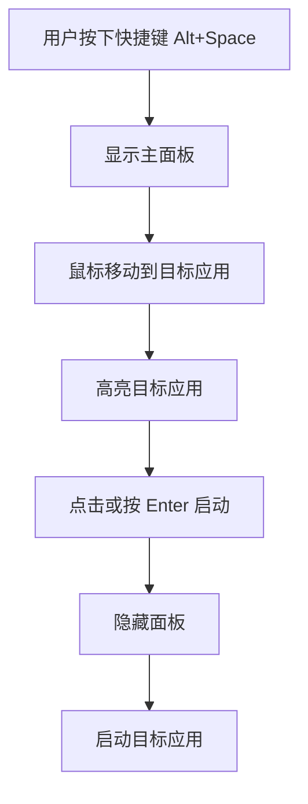
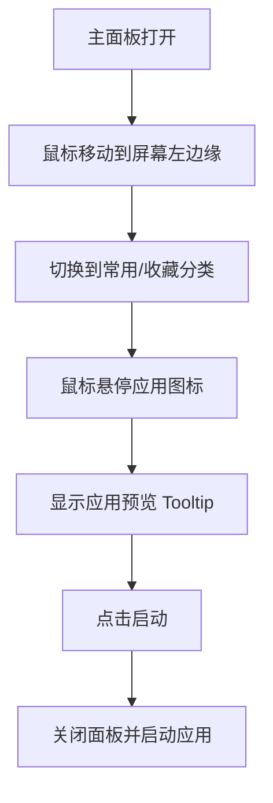
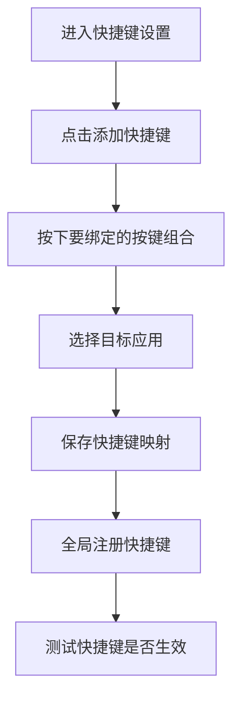

# 产品需求文档 (PRD)

## 1. 产品概述

**鼠标极速启动器** — 一款 Windows 平台的高效应用快速启动和切换工具。用户通过全局快捷键呼出悬浮面板，使用鼠标移动或快捷键在应用列表中快速定位并启动目标应用，同时支持鼠标手势切换面板功能。

- **核心价值**: 将鼠标移动与键盘快捷键结合，实现比传统开始菜单更快的应用启动体验
- **目标用户**: 高效率工作者、开发者、设计师等 Windows 电脑重度用户
- **平台**: Windows 10/11

## 2. 核心功能

### 2.1 功能模块

1. **主面板 (Main Panel)**: 全局悬浮的弧形/圆形应用选择面板
2. **应用浏览器 (App Browser)**: 搜索和浏览已安装应用的界面
3. **快捷键映射器 (Shortcut Mapper)**: 用户自定义快捷键触发不同应用
4. **鼠标手势 (Mouse Gestures)**: 通过鼠标移动到屏幕边缘切换分类或面板
5. **设置面板 (Settings)**: 主题、快捷键、行为习惯等配置

### 2.2 页面详情

| 页面名称 | 模块名称 | 功能描述 |
|---------|---------|---------|
| 主面板 | 弧形应用列表 | 显示收藏/常用应用，鼠标悬停高亮，滚轮或方向键切换 |
| 主面板 | 搜索框 | 快速搜索已安装应用，支持模糊匹配 |
| 主面板 | 分类导航 | 按类别（工具、开发、设计、娱乐等）筛选应用 |
| 主面板 | 鼠标手势区 | 屏幕四边设置手势区域，鼠标滑入触发分类切换 |
| 应用浏览器 | 应用卡片网格 | 展示所有可用应用，显示图标、名称、使用频率 |
| 应用浏览器 | 分类标签栏 | 顶部横向标签栏，支持多选分类筛选 |
| 快捷键映射器 | 快捷键列表 | 显示用户自定义的快捷键绑定 |
| 快捷键映射器 | 快捷键编辑 | 新增/修改/删除快捷键与应用映射 |
| 设置面板 | 外观设置 | 主题选择、面板透明度、动画效果 |
| 设置面板 | 快捷键设置 | 自定义呼出快捷键 |
| 设置面板 | 鼠标手势设置 | 边缘手势开关、触发阈值、对应动作 |
| 设置面板 | 高级设置 | 开机启动、最小化到托盘、内存优化 |

## 3. 核心流程

### 3.1 应用启动流程

### 3.2 鼠标手势切换流程

### 3.3 快捷键映射流程

## 4. 用户界面设计

### 4.1 设计风格

**主题方向**: 毛玻璃质感 + 霓虹蓝/紫点缀 — 现代 Windows 11 风格

- **主色调**: 深色背景 (#1E1E1E) 配以霓虹蓝 (#00A4EF) 和霓虹紫 (#8763F6)
- **次要色**: 柔和的灰色 (#2D2D2D) 用于面板背景
- **毛玻璃效果**: Background blur (20-30px)，透明度 70-80%
- **按钮风格**: 圆角矩形 (border-radius: 8px)，悬停时带有发光效果
- **字体**: Segoe UI Variable (系统字体) 配合 JetBrains Mono (快捷键显示)
- **布局风格**: 中心辐射式布局，应用图标围绕中心圆形排列
- **图标风格**: Fluent Design 风格，简洁线性图标

### 4.2 页面设计概述

| 页面名称 | 模块名称 | UI 元素描述 |
|---------|---------|------------|
| 主面板 | 弧形应用列表 | 毛玻璃背景，应用图标悬停在弧形轨迹上，发光边框效果 |
| 主面板 | 中心搜索框 | 圆角输入框，搜索图标，实时搜索建议 |
| 主面板 | 鼠标边缘区域 | 屏幕四边显示隐藏的手势触发区域指示 |
| 主面板 | 底部状态栏 | 显示当前分类、快捷键提示 |
| 应用浏览器 | 应用卡片网格 | 响应式网格，每张卡片显示图标+名称+使用频率 |
| 应用浏览器 | 筛选标签栏 | 顶部横向标签，支持多选分类筛选 |
| 快捷键映射器 | 映射列表 | 左侧快捷键徽章，右侧应用图标+名称 |
| 快捷键映射器 | 编辑弹窗 | 快捷键录制区，下方应用选择网格 |
| 设置面板 | 分组卡片 | 设置项以卡片形式分组，带开关/滑块/下拉 |

### 4.3 响应式设计

- **窗口适配**: 面板大小根据屏幕分辨率自动调整
- **多显示器**: 支持多显示器环境下在不同屏幕呼出面板
- **高分屏**: 完美支持 100%-300% 缩放

### 4.4 交互动效

- **面板呼出**: 从中心点向外扩散 (scale 0.8 → 1.0, 150ms ease-out)
- **图标悬停**: 图标放大 1.15 倍，背景发光 (box-shadow: 0 0 24px)
- **面板关闭**: 快速收缩回中心点 (100ms ease-out)
- **应用启动**: 选中图标扩散消失 + 涟漪效果
- **鼠标边缘触发**: 边缘区域淡入高亮

### 4.5 视觉概念图生成

使用生图功能为以下界面生成视觉概念图：

1. **主面板概念图** - 弧形应用选择面板，毛玻璃质感，霓虹蓝/紫点缀
2. **应用浏览器概念图** - 网格布局的应用卡片，Windows 11 风格
3. **快捷键设置概念图** - 快捷键与应用映射界面
4. **设置面板概念图** - Windows 11 Fluent 风格的设置界面
