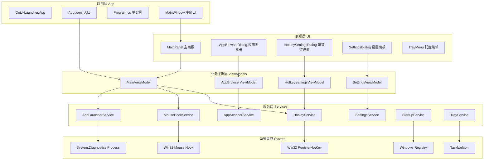

# 技术架构文档 (WinUI 3)

## 1. 整体架构



## 2. 技术选型

| 类别 | 技术 | 版本 |
|------|------|------|
| 桌面框架 | WinUI 3 (Windows App SDK) | 1.5+ |
| 运行时 | .NET | 8.0 |
| 开发语言 | C# | 12.0 |
| UI 标记 | XAML | - |
| 设计系统 | Microsoft Fluent Design System | - |
| MVVM 框架 | CommunityToolkit.Mvvm | 8.3+ |
| 系统托盘 | H.NotifyIcon.WinUI | 2.1+ |
| 序列化 | System.Text.Json | - |
| 打包工具 | MSIX | - |

## 3. 项目结构

```
QuickLauncher/
├── QuickLauncher.sln
├── README.md
└── src/
    └── QuickLauncher/
        ├── QuickLauncher.csproj
        ├── app.manifest
        ├── Package.appxmanifest
        ├── App.xaml
        ├── App.xaml.cs
        ├── Program.cs
        ├── Assets/
        │   ├── tray.ico
        │   └── StoreLogo.png
        ├── Models/
        │   ├── AppInfo.cs
        │   ├── HotkeyConfig.cs
        │   ├── EdgeGesture.cs
        │   └── AppCategory.cs
        ├── Services/
        │   ├── IHotkeyService.cs
        │   ├── HotkeyService.cs
        │   ├── IMouseHookService.cs
        │   ├── MouseHookService.cs
        │   ├── IAppLauncherService.cs
        │   ├── AppLauncherService.cs
        │   ├── IAppScannerService.cs
        │   ├── AppScannerService.cs
        │   ├── ISettingsService.cs
        │   ├── SettingsService.cs
        │   ├── IStartupService.cs
        │   └── StartupService.cs
        ├── ViewModels/
        │   ├── MainViewModel.cs
        │   ├── AppBrowserViewModel.cs
        │   ├── HotkeySettingsViewModel.cs
        │   └── SettingsViewModel.cs
        ├── Views/
        │   ├── MainPanel.xaml
        │   ├── MainPanel.xaml.cs
        │   ├── AppBrowserDialog.xaml
        │   ├── AppBrowserDialog.xaml.cs
        │   ├── HotkeySettingsDialog.xaml
        │   ├── HotkeySettingsDialog.xaml.cs
        │   ├── SettingsDialog.xaml
        │   └── SettingsDialog.xaml.cs
        ├── Controls/
        │   ├── ArcCanvas.cs
        │   └── AppIconButton.cs
        ├── Themes/
        │   ├── Colors.xaml
        │   ├── Styles.xaml
        │   └── Generic.xaml
        ├── Converters/
        │   ├── BoolToVisibilityConverter.cs
        │   └── CategoryToIconConverter.cs
        └── Helpers/
            ├── HotkeyParser.cs
            ├── JsonHelper.cs
            └── NativeMethods.cs
```

## 4. 核心数据模型

### 4.1 AppInfo

```csharp
public record AppInfo
{
    public string Id { get; init; } = string.Empty;
    public string Name { get; init; } = string.Empty;
    public string IconPath { get; init; } = string.Empty;
    public string ExecutablePath { get; init; } = string.Empty;
    public string[]? Args { get; init; }
    public AppCategory Category { get; init; } = AppCategory.Other;
    public int LaunchCount { get; set; } = 0;
    public DateTime LastUsed { get; set; } = DateTime.MinValue;
    public bool IsFavorite { get; set; } = false;
}
```

### 4.2 AppCategory 枚举

```csharp
public enum AppCategory
{
    All,
    Favorites,
    Recent,
    Development,
    Design,
    Productivity,
    Communication,
    Entertainment,
    System,
    Other
}
```

### 4.3 HotkeyConfig

```csharp
public record HotkeyConfig
{
    public string Id { get; init; } = Guid.NewGuid().ToString();
    public string DisplayKey { get; init; } = string.Empty;  // "Alt+Space"
    public uint Modifiers { get; init; }  // MOD_ALT | MOD_CONTROL ...
    public uint VirtualKey { get; init; }
    public HotkeyAction Action { get; init; }
    public string? AppId { get; init; }
}
```

### 4.4 EdgeGesture

```csharp
public record EdgeGesture
{
    public ScreenEdge Edge { get; init; }
    public int Threshold { get; init; } = 10;
    public GestureAction Action { get; init; }
    public object? Params { get; init; }
}

public enum ScreenEdge { Top, Bottom, Left, Right }
```

## 5. 服务层接口

### 5.1 IHotkeyService

```csharp
public interface IHotkeyService
{
    bool Register(HotkeyConfig config);
    bool Unregister(string id);
    void UnregisterAll();
    IReadOnlyList<HotkeyConfig> GetRegistered();
    event EventHandler<HotkeyTriggeredEventArgs>? HotkeyTriggered;
}
```

### 5.2 IMouseHookService

```csharp
public interface IMouseHookService
{
    void Start();
    void Stop();
    void RegisterEdge(EdgeGesture gesture);
    void UnregisterEdge(ScreenEdge edge);
    event EventHandler<EdgeEnteredEventArgs>? EdgeEntered;
    event EventHandler<EdgeExitedEventArgs>? EdgeExited;
}
```

### 5.3 IAppLauncherService

```csharp
public interface IAppLauncherService
{
    Task LaunchAsync(AppInfo app);
    Task LaunchByPathAsync(string path, string[]? args = null);
    event EventHandler<AppLaunchedEventArgs>? AppLaunched;
}
```

### 5.4 IAppScannerService

```csharp
public interface IAppScannerService
{
    Task<IReadOnlyList<AppInfo>> ScanInstalledAppsAsync(IProgress<double>? progress = null);
    Task<IReadOnlyList<AppInfo>> GetByCategoryAsync(AppCategory category);
    Task<IReadOnlyList<AppInfo>> GetFavoritesAsync();
    Task<IReadOnlyList<AppInfo>> GetRecentAsync(int limit = 10);
    Task ToggleFavoriteAsync(string appId);
}
```

### 5.5 ISettingsService

```csharp
public interface ISettingsService
{
    T? Get<T>(string key);
    void Set<T>(string key, T value);
    AppSettings Current { get; }
    event EventHandler<SettingChangedEventArgs>? SettingChanged;
}
```

## 6. XAML 资源与样式

### 6.1 主题色定义 (Colors.xaml)

```xml
<ResourceDictionary>
    <!-- 强调色 -->
    <Color x:Key="AccentBlueColor">#00A4EF</Color>
    <Color x:Key="AccentPurpleColor">#8763F6</Color>
    
    <!-- 背景色 -->
    <Color x:Key="PanelBackgroundColor">#1C1C1C</Color>
    <Color x:Key="PanelBackgroundAltColor">#2D2D2D</Color>
    
    <!-- 笔刷 -->
    <SolidColorBrush x:Key="AccentBlueBrush" Color="{StaticResource AccentBlueColor}"/>
    <SolidColorBrush x:Key="AccentPurpleBrush" Color="{StaticResource AccentPurpleColor}"/>
    <SolidColorBrush x:Key="PanelBackgroundBrush" Color="{StaticResource PanelBackgroundColor}"/>
</ResourceDictionary>
```

### 6.2 通用样式 (Styles.xaml)

```xml
<ResourceDictionary>
    <!-- 应用图标按钮样式 -->
    <Style x:Key="AppIconButtonStyle" TargetType="Button">
        <Setter Property="Width" Value="64"/>
        <Setter Property="Height" Value="64"/>
        <Setter Property="CornerRadius" Value="14"/>
        <Setter Property="Background" Value="{ThemeResource LayerFillColorDefaultBrush}"/>
        <Setter Property="BorderBrush" Value="Transparent"/>
    </Style>
    
    <!-- 强调按钮样式 -->
    <Style x:Key="AccentButtonStyle" TargetType="Button">
        <Setter Property="Background" Value="{StaticResource AccentBlueBrush}"/>
        <Setter Property="Foreground" Value="White"/>
        <Setter Property="CornerRadius" Value="8"/>
        <Setter Property="Padding" Value="16,8"/>
    </Style>
</ResourceDictionary>
```

## 7. 关键 XAML 页面

### 7.1 主面板 (MainPanel.xaml)

- Mica 材质背景
- 圆形窗口 (CornerRadius=360)
- 顶部 AutoSuggestBox 搜索框
- 中间 ArcCanvas 自定义控件显示弧形应用
- 底部 SelectorBar 分类标签

### 7.2 应用浏览器 (AppBrowserDialog.xaml)

- ContentDialog 模态弹窗
- 顶部 AutoSuggestBox + SelectorBar 分类
- 中部 ItemsRepeater 网格布局
- 底部 PrimaryButton/CloseButton

### 7.3 快捷键设置 (HotkeySettingsDialog.xaml)

- ContentDialog 模态弹窗
- ListView 显示已绑定的快捷键
- 底部添加按钮和提示

### 7.4 设置面板 (SettingsDialog.xaml)

- ContentDialog 模态弹窗
- NavigationView 左侧导航
- 右侧 Frame 显示分组设置

## 8. 系统集成

### 8.1 Win32 API 封装 (NativeMethods.cs)

```csharp
internal static class NativeMethods
{
    public const int WH_MOUSE_LL = 14;
    public const uint MOD_ALT = 0x0001;
    public const uint MOD_CONTROL = 0x0002;
    public const uint MOD_SHIFT = 0x0004;
    public const uint MOD_WIN = 0x0008;
    public const int WM_HOTKEY = 0x0312;
    
    [DllImport("user32.dll", SetLastError = true)]
    [return: MarshalAs(UnmanagedType.Bool)]
    public static extern bool RegisterHotKey(IntPtr hWnd, int id, uint fsModifiers, uint vk);
    
    [DllImport("user32.dll", SetLastError = true)]
    [return: MarshalAs(UnmanagedType.Bool)]
    public static extern bool UnregisterHotKey(IntPtr hWnd, int id);
    
    [DllImport("user32.dll", CharSet = CharSet.Auto, SetLastError = true)]
    public static extern IntPtr SetWindowsHookEx(int idHook, LowLevelMouseProc lpfn, IntPtr hMod, uint dwThreadId);
    
    [DllImport("user32.dll", CharSet = CharSet.Auto, SetLastError = true)]
    [return: MarshalAs(UnmanagedType.Bool)]
    public static extern bool UnhookWindowsHookEx(IntPtr hhk);
    
    [DllImport("user32.dll", CharSet = CharSet.Auto, SetLastError = true)]
    public static extern IntPtr CallNextHookEx(IntPtr hhk, int nCode, IntPtr wParam, IntPtr lParam);
    
    [DllImport("user32.dll")]
    public static extern bool GetCursorPos(out POINT lpPoint);
    
    [StructLayout(LayoutKind.Sequential)]
    public struct POINT
    {
        public int X;
        public int Y;
    }
    
    public delegate IntPtr LowLevelMouseProc(int nCode, IntPtr wParam, IntPtr lParam);
}
```

### 8.2 单实例应用 (Program.cs)

```csharp
public static class Program
{
    [STAThread]
    static int Main(string[] args)
    {
        WinRT.ComWrappersSupport.InitializeComWrappers();
        
        var isRedirect = DecideRedirection();
        if (!isRedirect)
        {
            Application.Start(p =>
            {
                var context = new DispatcherQueueSynchronizationContext(
                    DispatcherQueue.GetForCurrentThread());
                SynchronizationContext.SetSynchronizationContext(context);
                new App();
            });
        }
        return 0;
    }
    
    private static bool DecideRedirection()
    {
        bool isRedirect = false;
        var args = AppInstance.GetCurrent().GetActivatedEventArgs();
        var keyInstance = AppInstance.FindOrRegisterForKey("QuickLauncher");
        
        if (keyInstance.IsCurrent)
        {
            keyInstance.Activated += OnActivated;
        }
        else
        {
            isRedirect = true;
            // 将激活事件重定向到主实例
            RedirectAsync(keyInstance, args).GetAwaiter().GetResult();
        }
        return isRedirect;
    }
}
```

## 9. 打包与发布

### 9.1 项目文件 (QuickLauncher.csproj)

```xml
<Project Sdk="Microsoft.NET.Sdk">
  <PropertyGroup>
    <OutputType>WinExe</OutputType>
    <TargetFramework>net8.0-windows10.0.19041.0</TargetFramework>
    <TargetPlatformMinVersion>10.0.17763.0</TargetPlatformMinVersion>
    <RootNamespace>QuickLauncher</RootNamespace>
    <ApplicationManifest>app.manifest</ApplicationManifest>
    <Platforms>x86;x64;arm64</Platforms>
    <RuntimeIdentifiers>win-x86;win-x64;win-arm64</RuntimeIdentifiers>
    <UseWinUI>true</UseWinUI>
    <EnableMsixTooling>true</EnableMsixTooling>
    <Nullable>enable</Nullable>
    <LangVersion>12.0</LangVersion>
  </PropertyGroup>
  
  <ItemGroup>
    <PackageReference Include="Microsoft.WindowsAppSDK" Version="1.5.240607001" />
    <PackageReference Include="Microsoft.Windows.SDK.BuildTools" Version="10.0.22621.756" />
    <PackageReference Include="CommunityToolkit.Mvvm" Version="8.3.2" />
    <PackageReference Include="H.NotifyIcon.WinUI" Version="2.1.4" />
  </ItemGroup>
</Project>
```

## 10. 视觉原型设计

使用生图功能为以下界面生成完整的 WinUI 3 Fluent Design 原型设计图。
